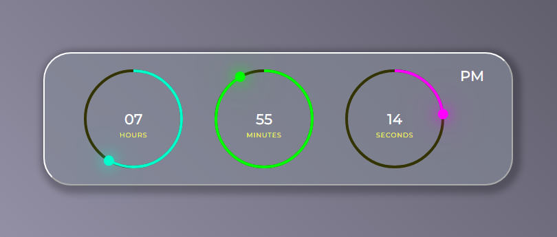

# Digital Clock 
#### What has been implemented:
* using javacript constructor ```new Date()``` to get values of hours, minutes and seconds
* succinct and simple CSS style
* switching time format AM/PM
* before single digit number add zero
* rotate class ```.dots``` by the specified angle with JS
* click here => [_**Digital Clock**_](https://bakna2t.github.io/clock/)
___
[](https://bakna2t.github.io/clock/)